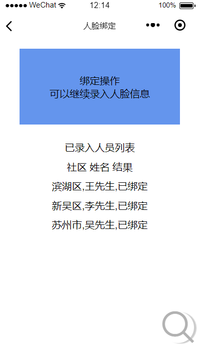
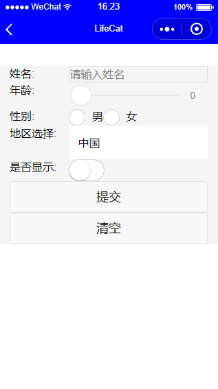

# lifecat-wechat

 
:cat: :smiley_cat: :kissing_cat:

> 为学习微信小程序，此项目仿照门禁系统搭建，具有8个主要页面，适合小程序的初级学习。可通过API与后台进行数据的交互

#### 微信搜索小程序 : LifeCatTen

### 后端API接口部署
[https://github.com/kevinten10/Springboot-lifecat](https://github.com/kevinten10/Springboot-lifecat)

### 后续项目线上地址 (建议由浅入深的按顺序学习)

[lifecatweb的jsp+servlet项目](http://www.lifecat.club:8080/lifecatweb)

[lifecatweb的ssm后台管理系统项目](http://www.lifecat.club:8080/ssm)

[Vuejs+SpringBoot前后端分离仿Ins图像网站(仅部署前端)](http://www.lifecat.club/lifecat)

[Vuejs+SpringBoot前后端分离后台管理系统(仅部署前端)](http://www.lifecat.club/admin)

## DEMO

 
 
 
 
 
 
 
  
### lifecat相关项目
  [v1 jsp+servlet+mysql实现Javaweb](https://github.com/kevinten10/lifecatweb)    
  [v2 ssm框架实现Javaweb后台管理系统](https://github.com/kevinten10/SSM-lifecat)  
  [v3 前后端分离之SpringBoot实现Java后端开发](https://github.com/kevinten10/springboot-lifecat)  
  [v3 前后端分离之vue实现后台管理系统](https://github.com/kevinten10/Vue-Admin-lifecat)  
  [v3 前后端分离之vue实现仿ins效果web开发](https://github.com/kevinten10/Web-lifecat)  
  
  [ex wechat 微信移动端小程序开发](https://github.com/kevinten10/WeChat-lifecat)  
  [ex hadoop 分布式平台进行数据处理](https://github.com/kevinten10/Hadoop-lifecat)  
  [ex android 相应Android相册应用](https://github.com/kevinten10/Android-lifecat)  
  [ex python 机器学习进行图像智能处理](https://github.com/kevinten10/Python-lifecat)  
  
  
